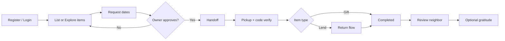

# Kindred

**Neighbors sharing kind** — a full-stack web app for lending, gifting, and sharing skills with people nearby. List items on a map, request to borrow, coordinate handoffs with a verification code, then leave reviews and thank-you notes that build community trust.

---

## Table of contents

- [Features](#features)
- [Tech stack](#tech-stack)
- [How it works](#how-it-works)
- [Project structure](#project-structure)
- [Getting started](#getting-started)
- [Environment variables](#environment-variables)
- [Available scripts](#available-scripts)
- [API overview](#api-overview)
- [Trust, reviews & gratitude](#trust-reviews--gratitude)
- [Handoff flow](#handoff-flow)
- [Development notes](#development-notes)
- [Troubleshooting](#troubleshooting)
- [License](#license)

---

## Features

| Area | What you can do |
|------|-----------------|
| **Auth** | Register, log in, log out with JWT access + refresh tokens stored in **httpOnly cookies** |
| **Listings** | Create items to **lend**, **gift**, or offer as a **skill**; upload images (Cloudinary); set category, condition, location |
| **Explore** | Browse nearby listings on a **map** (Mapbox or OpenStreetMap) with radius and category filters |
| **Requests** | Borrowers pick dates on a calendar and send a request; owners approve, reject, or borrowers cancel |
| **Handoff** | Owner starts pickup plan → both confirm time → 4-digit code → verify → return flow for lends |
| **Reviews** | After a completed exchange, rate the other person **1–5 stars** with an optional public comment |
| **Gratitude** | Optional thank-you tokens and messages on profiles (no star ratings) |
| **Profiles** | Trust ring, badges, average rating, listings, reviews wall, gratitude wall |
| **Trust score** | Computed from handoffs, helpfulness votes, items shared, and review ratings |

**Not included:** in-app chat / direct messaging (removed by design).

---

## Tech stack

| Layer | Technologies |
|-------|----------------|
| **Frontend** | React 18, Vite, React Router, Tailwind CSS, Axios, React Hook Form, Leaflet / react-leaflet, Lucide icons, react-hot-toast |
| **Backend** | Node.js, Express, Mongoose, Socket.IO (server-side events only) |
| **Database** | MongoDB (Atlas or local) |
| **Auth** | bcrypt, jsonwebtoken, cookie-parser |
| **Media** | Cloudinary (optional in dev), Multer |
| **Maps** | Mapbox tiles (optional) or OpenStreetMap fallback |

---

## How it works



1. **Neighbors** create accounts with a location (used for nearby search).
2. **Owners** list items; **borrowers** find them on Explore or Home and submit a date range + message.
3. When a request is **approved**, the owner **starts handoff** and sets pickup details.
4. Both parties **confirm** the pickup window; a **4-digit code** is shown to the owner and entered by the borrower.
5. For **lends**, the borrower later marks return and the owner confirms receipt.
6. The request becomes **completed**; users are prompted to **leave a review**, then may send **gratitude**.

---

## Project structure

```
kind/
├── package.json          # Root scripts (install:all, dev, build, seed)
├── README.md
├── client/               # React + Vite frontend
│   ├── src/
│   │   ├── api/          # Axios API modules
│   │   ├── components/   # UI, layout, items, handoff, profile, gratitude
│   │   ├── context/      # AuthContext
│   │   ├── hooks/
│   │   ├── pages/        # Route pages
│   │   └── utils/
│   ├── vite.config.js    # Dev proxy: /api → backend
│   └── .env              # VITE_* (see below)
└── server/               # Express API
    ├── server.js         # App entry, CORS, routes, Socket.IO
    ├── config/           # MongoDB, Cloudinary
    ├── controllers/
    ├── models/
    ├── routes/
    ├── middleware/       # auth, upload, errors
    ├── socket/           # Socket.IO (user rooms, notifications)
    ├── utils/            # JWT, cookies, trust score
    ├── seed.js           # Demo users & items
    └── .env              # Server secrets (see below)
```

---

## Getting started

### Prerequisites

- **Node.js** 18+ (20+ recommended)
- **npm**
- **MongoDB** — [MongoDB Atlas](https://www.mongodb.com/cloud/atlas) or local (`mongodb://127.0.0.1:27017/kindred`)

### 1. Clone and install

```bash
cd kind
npm run install:all
```

### 2. Configure environment

Copy and edit env files (see [Environment variables](#environment-variables)).

- `server/.env` — database, JWT secrets, optional Cloudinary
- `client/.env` — optional Mapbox token

### 3. Seed demo data (optional)

```bash
npm run seed
```

Creates local demo users (e.g. `maya@kindred.local` / `password123`) and sample listings in Brooklyn-area coordinates.

### 4. Run in development

From the project root:

```bash
npm run dev
```

This starts:

| Service | URL |
|---------|-----|
| API | http://localhost:5000 |
| Web app | http://localhost:5173 |

The Vite dev server **proxies** `/api` to the backend so auth cookies stay on the same origin. Do **not** set `VITE_API_URL` to `http://localhost:5000/api` in local dev unless you know you need cross-origin setup.

### 5. Production build (frontend)

```bash
npm run build
```

Serve `client/dist` behind your host and point API requests to your deployed backend. Set `CLIENT_URL` on the server to your frontend origin(s).

---

## Environment variables

### Server (`server/.env`)

| Variable | Required | Description |
|----------|----------|-------------|
| `MONGO_URI` | Production | MongoDB connection string. In dev, omitted/placeholder falls back to `mongodb://127.0.0.1:27017/kindred` |
| `JWT_ACCESS_SECRET` | Production | Secret for short-lived access tokens |
| `JWT_REFRESH_SECRET` | Production | Secret for refresh tokens |
| `JWT_ACCESS_EXPIRES_IN` | No | Default `15m` |
| `JWT_REFRESH_EXPIRES_IN` | No | Default `7d` |
| `PORT` | No | Default `5000` |
| `NODE_ENV` | No | `production` enforces secrets and secure cookies |
| `CLIENT_URL` | No | Comma-separated allowed CORS origins (default includes `localhost:5173` and `127.0.0.1:5173`) |
| `CLOUDINARY_CLOUD_NAME` | No | Image uploads; placeholder skips upload |
| `CLOUDINARY_API_KEY` | No | |
| `CLOUDINARY_API_SECRET` | No | |

**Atlas tip:** URL-encode special characters in the password (`@` → `%40`, `#` → `%23`).

### Client (`client/.env`)

| Variable | Required | Description |
|----------|----------|-------------|
| `VITE_API_URL` | No | Leave unset in dev to use `/api` proxy. Set for production, e.g. `https://api.example.com/api` |
| `VITE_MAPBOX_TOKEN` | No | Mapbox token for Explore map tiles; without it, OpenStreetMap is used |
| `VITE_SOCKET_URL` | No | Only if you add real-time client features later |

---

## Available scripts

| Command | Description |
|---------|-------------|
| `npm run install:all` | Install dependencies in `server/` and `client/` |
| `npm run dev` | Run API + Vite concurrently |
| `npm run build` | Build client for production |
| `npm run seed` | Seed demo users and items |
| `npm run dev --prefix server` | API only |
| `npm run dev --prefix client` | Frontend only |

---

## API overview

Base URL: `http://localhost:5000/api` (or proxied as `/api` in dev).

| Prefix | Purpose |
|--------|---------|
| `/auth` | `POST /register`, `/login`, `/logout`, `/refresh-token` |
| `/users` | `GET /me`, `PUT /me`, `GET /:id`, `GET /nearby` |
| `/items` | CRUD, availability, borrowed/gifted lists, geo search |
| `/requests` | Create, incoming/outgoing, approve, reject, cancel |
| `/handoff` | Initiate, pickup details, confirm, verify code, return |
| `/reviews` | Create review, list by user, check review for request |
| `/gratitude` | Send thanks, list received/sent |
| `/health` | Health check |

Protected routes expect a valid `accessToken` cookie (or `Authorization: Bearer` header). On `401`, the client attempts `/auth/refresh-token` once.

---

## Trust, reviews & gratitude

### Trust score (0–100)

Calculated in `server/utils/calcTrustScore.js` from:

- Successful handoffs
- Helpfulness votes (gratitude received)
- Items shared
- Review ratings (average × count, capped contribution)

Badges include **First Share**, **10 Handoffs**, **Super Neighbor**, **Community Helper**, and **Highly Rated** (3+ reviews, 4.5+ average).

### Reviews

- One review per user per completed **request**
- Rating 1–5, optional comment, public by default
- Shown on profiles; updates `ratingAverage` and `ratingCount`

### Gratitude

- Token types: seedling, hammer, sparkle, heart, star (emoji badges, not star ratings)
- Optional message; can be public or private on profile

---

## Handoff flow

| Step | Who | Action |
|------|-----|--------|
| 1 | Owner | Start handoff on approved request |
| 2 | Owner | Set pickup method, location, time |
| 3 | Both | Confirm pickup plan |
| 4 | Owner | Shows 4-digit code |
| 5 | Borrower | Enters code to complete pickup |
| 6 | Borrower (lend) | Marks item returning |
| 7 | Owner (lend) | Confirms item received |
| 8 | Both | Redirected to **review** page |

**Gift** items skip return and complete after code verification.

---

## Development notes

- **Item types:** `lend` (return expected), `gift` (keep), `skill` (same handoff pattern)
- **Item categories:** Tools, Kitchen, Electronics, Sports, Garden, Skills, Other
- **Request statuses:** `pending` → `approved` → `active` (lend) or `completed` (gift) → `completed`
- **Images:** Without Cloudinary credentials, listings work but image upload returns empty URLs
- **Location:** Geo queries use MongoDB `2dsphere` indexes on User and Item
- **Socket.IO:** Server emits `request_update`, `handoff_update`, `notification`, `new_gratitude` to user rooms; no chat UI on the client

### Frontend routes

| Path | Access | Page |
|------|--------|------|
| `/` | Public | Home |
| `/explore` | Public | Map + listings |
| `/items/:id` | Public | Item detail + calendar |
| `/login`, `/register` | Public | Auth |
| `/dashboard` | Auth | Dashboard |
| `/my-items`, `/add-item` | Auth | Manage listings |
| `/requests` | Auth | Incoming / outgoing requests |
| `/handoff/:requestId` | Auth | Handoff coordinator |
| `/review/:requestId` | Auth | Rate neighbor |
| `/gratitude/:requestId` | Auth | Send thanks |
| `/profile/me`, `/profile/:id` | Auth / public | Profile |

---

## Troubleshooting

| Issue | What to try |
|-------|-------------|
| `bad auth : authentication failed` (MongoDB) | Fix `MONGO_URI` credentials; URL-encode password; or use local `mongodb://127.0.0.1:27017/kindred` |
| `401` on `/api/users/me` or requests | Log in again; ensure API and client both restarted; avoid hardcoding `VITE_API_URL` to port 5000 in dev |
| Cookies not sent | Use http://localhost:5173 (not mixing `127.0.0.1` and `localhost` for the same session) |
| Map blank | Optional: set `VITE_MAPBOX_TOKEN`; otherwise OSM tiles should still load |
| Images not uploading | Add valid Cloudinary env vars in `server/.env` |

---

## License

This project is provided as-is for learning and local use. Add your preferred license file if you distribute or deploy it.

---

## Quick links

- [MongoDB Atlas](https://www.mongodb.com/cloud/atlas)
- [Cloudinary](https://cloudinary.com/)
- [Mapbox](https://www.mapbox.com/)
- [Vite proxy docs](https://vite.dev/config/server-options.html#server-proxy)
